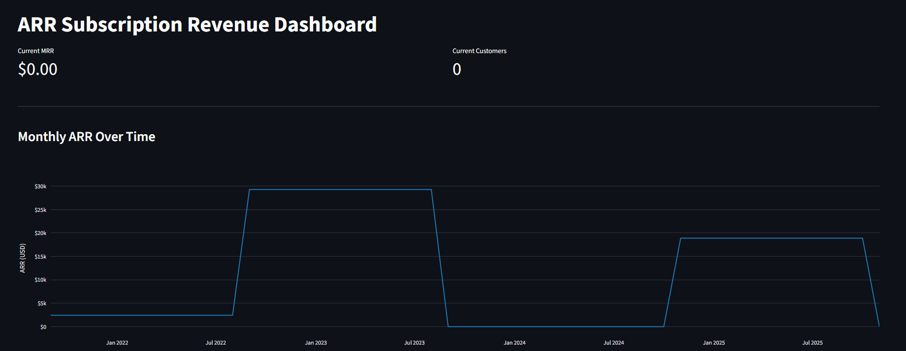

# Subscription Revenue Modelling (dbt)

## Overview

Analytical modelling of **Annual Recurring Revenue (ARR)** for a subscription-based business, built with [dbt](https://www.getdbt.com/) and [DuckDB](https://duckdb.org/) for fully local, reproducible execution.



**Stack:** Python 3.13+ (for virtual environment) · dbt-duckdb · SQL · DuckDB

## Problem Statement

Subscription revenue introduces complexities that transactional data does not: time-based allocation, recurring charges, upgrades, downgrades, churn, and reactivations. Traditional reporting often fails to capture these dynamics accurately.

This project models ARR at a **monthly grain**, producing a clean analytical dataset that categorizes month-over-month revenue changes per account. The output supports dashboards, trend analysis, and business reviews around subscription health.

## What This Project Does

- Ingests raw subscription data (accounts, products, start/end dates, ARR)
- Cleans and validates data quality issues at the staging layer
- Generates a monthly date spine and expands subscriptions to active months
- Aggregates ARR per account per month
- Classifies each month's revenue change as: **New**, **Upgrade**, **Downgrade**, **Churn**, **Reactivation**, or **No-change**
- Produces a final fact table (`fct_monthly_arr`) ready for analytical consumption

## Architecture

```
seeds/raw_subscriptions.csv
    |
    v
staging/stg_subscriptions              -- clean, typed, validated, filtered
staging/stg_subscriptions_quarantine   -- consolidated view of quarantined records
    |
    v
intermediate/int_date_spine            -- monthly calendar spine (dbt_utils.date_spine)
intermediate/int_subscription_months  -- 1 row per subscription x active month
intermediate/int_account_monthly_arr  -- ARR aggregated per account x month
                                       -- gap-filled monthly series + previous_month_arr LAG
    |
    v
marts/fct_monthly_arr                  -- final fact table with change classification
```

## Tech Stack

| Component | Tool |
|-----------|------|
| Transformation | dbt-core |
| Warehouse | DuckDB (local) |
| Packages | dbt_utils, codegen |
| Language | SQL + Python (visualization) |

## Quick Start

> Ideally you should have UV installed. See: https://docs.astral.sh/uv/getting-started/installation/

```bash
# Clone and install dependencies
git clone https://github.com/Gerardo1909/subscription-revenue-modelling-dbt> && cd subscription-revenue-modelling-dbt
uv sync
```

Before running the project, you should create a "profiles.yml" file in the `arr_modeling` directory. Here goes an example configuration:

```yaml
arr_profile:
  target: dev
  outputs:
    dev:
      type: duckdb
      path: "subs_data.duckdb"
```

Then you could run the project:

```bash
# Install dbt packages and build
cd arr_modeling
uv run dbt deps
uv run dbt build
```

## Project Structure

```
arr_modeling/
  models/
    staging/           -- data cleaning and validation
    intermediate/      -- date spine, subscription expansion, aggregation
    marts/             -- final analytical models
  seeds/               -- raw subscription data (CSV)
  macros/              -- reusable SQL macros
  tests/               -- singular data tests
```

## BI checks

After running `dbt build`, you could execute a couple of interesting queries from a BI perspective:

```bash
uv run scripts/BI_queries.py
```

This will print on console the result of the following two queries:

1. To check on quarantine records:

```sql
SELECT quarantine_reason, count(*) as records
FROM main.stg_subscriptions_quarantine
GROUP BY 1
ORDER BY 2 DESC;
```

2. To check on main fact table:

```sql
SELECT date_month, monthly_arr, change_category
FROM main.fct_monthly_arr
ORDER BY date_month;
```

## Visualization

After running `dbt build`, launch the ARR dashboard:

```bash
uv run streamlit run scripts/app.py
```

Opens at http://localhost:8501. Shows KPI cards and ARR trending chart.

## Key Design Decisions

### Data Quality & Staging

- **End date is inclusive**: a subscription with `end_date = Sep 8` is considered active throughout September (evaluated at last day of month).
- **Free subscriptions**: ARR sentinel values (`1e-9`) are mapped to `$0.00` via `CASE WHEN arr > 0 AND arr < 0.001`. The positive guard prevents silently zeroing legitimate negative values.
- **Negative ARR**: records with `arr_usd < 0` are filtered in staging. A singular test (`assert_no_negative_arr`) guards against future ingestion of negative values.
- **Quarantine architecture**: invalid records from the source (inverted dates, negative ARR) are persisted to an audit schema via dbt's `store_failures: true`. `stg_subscriptions_quarantine` is a consolidated view over those audit tables — adding a new validation rule requires only a new singular test, no model changes.
- **Separation of concerns**: singular tests on `raw_subscriptions` catch source data problems (ingestion team's responsibility); YAML tests on `stg_subscriptions` guard DE-owned model logic. Only the former are surfaced in the quarantine view.

### Fact Table & ARR Classification

- **Monthly grain**: a subscription is active in a month if it is live on the last day of that month (`start_date <= last_day(month) AND end_date >= last_day(month)`).
- **Gap-filled account-month series**: `int_account_monthly_arr` builds a continuous monthly spine per account from `first_active_month` to `last_active_month`, then left-joins real ARR months and fills missing months with `0.0`. This makes interim inactivity explicit in the model.
- **LAG over gap-filled timeline**: `previous_month_arr` is computed via `LAG()` over the full gap-filled series per account. This enables correct detection of interim transitions such as `churn` in a zero month and `reactivation` when ARR resumes.
- **change_category logic** (evaluated in order):

| Category | Condition |
|----------|-----------|
| `new` | First month the account ever had ARR |
| `churn` | ARR drops to 0 from a non-zero base |
| `reactivation` | ARR > 0 after a gap (`previous_month_arr = 0`, not first month) |
| `upgrade` | ARR increased from a non-zero base |
| `downgrade` | ARR decreased but remains > 0 |
| `no_change` | ARR unchanged month-over-month |

### Infrastructure

- **Local-first**: runs entirely on DuckDB with no cloud dependencies.
- **store_failures**: all dbt tests persist failures to `main_audit.*` for post-build inspection.

## Contribution & License

**Author:** Gerardo Toboso  
**Contact:** gerardotoboso1909@gmail.com  
**License:** MIT License
